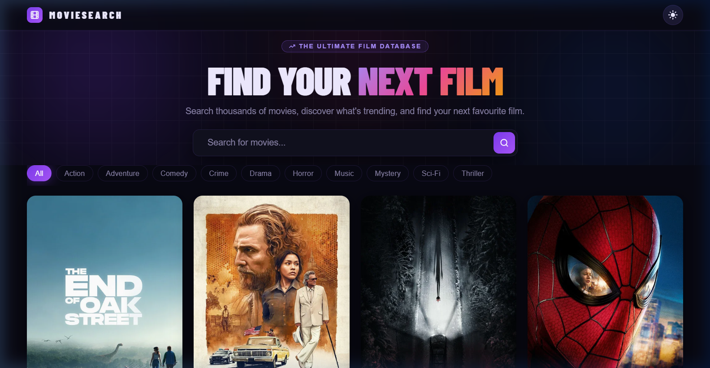
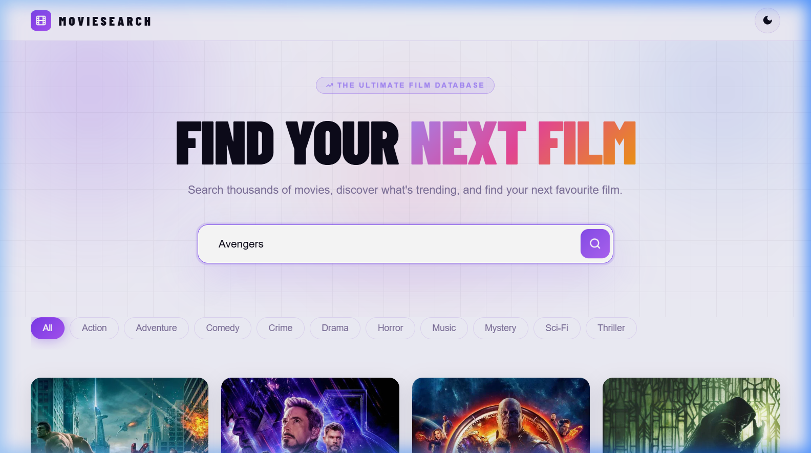
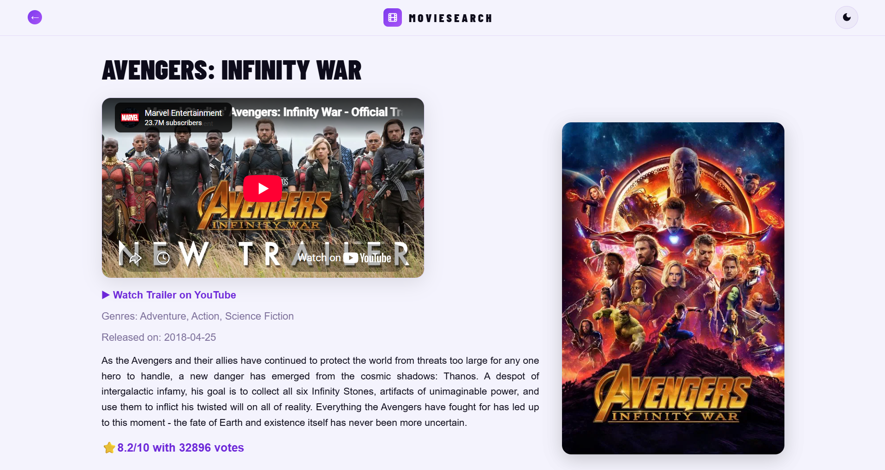
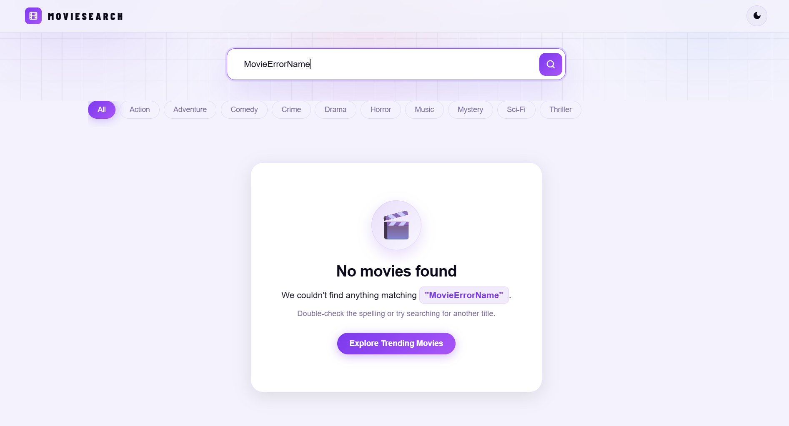

# 🎬 MovieSearch — Premium Film Discovery App

> Search thousands of movies, discover what's trending, filter by genre, and dive into full movie detail pages — all powered by the TMDB API.

---

## 🌐 Live Demo

The project is live right now! Check it out here:
👉 [movie-search-lemon-iota.vercel.app](https://movie-search-lemon-iota.vercel.app/)

---

## About

**MovieSearch** is a sleek, premium-feeling movie discovery web app built with vanilla HTML, CSS, and JavaScript. It lets users search for any film, browse trending movies, filter by genre, and view rich detail pages complete with trailers, release dates, genres, and ratings. The UI features animated hero orbs, a grid background, gradient typography, dark/light mode, and smooth hover interactions for a truly polished experience.

---

## 📸 Screenshots

### 1. Initial UI — Landing View
> The hero section with the animated background, search bar, genre pill filters, and trending movie grid.

<div align="center">
  
</div>

---

### 2. After Searching — Search Results View
> Search results shown after querying "Avengers" — the movie grid updates live with matching titles.

<div align="center">
  
</div>

---

### 3. Movie Detail View
> Clicking any movie card navigates to a full detail page with trailer embed, genres, release date, synopsis, and poster.

<div align="center">
  
</div>

---

### 4. Error View — No Results Found
> When a search returns no matches, a friendly no-results state is displayed with the queried term highlighted and pagination buttons hidden.

<div align="center">
  
</div>

---

## 🚀 Features

- 🔍 **Live Movie Search** — Search any movie by name using the TMDB search API
- 📈 **Trending Movies** — Landing page loads today's trending films automatically
- 🎭 **Genre Filtering** — Filter movies by genre (Action, Adventure, Comedy, Crime, Drama, Horror, Music, Mystery, Sci-Fi, Thriller)
- 🎬 **Movie Detail Pages** — Full detail view with:
  - Embedded YouTube trailer
  - "Watch Trailer on YouTube" direct link
  - Genre tags, release date, synopsis, star rating with vote count, and movie poster
- 🌙 **Dark / Light Mode** — Theme toggle with `localStorage` persistence across sessions
- 📄 **Pagination** — Previous / Next page navigation for large result sets
- 🚫 **No Results State** — Friendly empty state with spelling hint when a search yields no movies; pagination is automatically hidden
- 📱 **Fully Responsive** — Optimised for desktop, laptop, tablet, and mobile

---

## 🎨 Design System & Aesthetics

| Token | Description |
|---|---|
| **Font — Display** | `Barlow Condensed` (700, 900) — used for hero headings |
| **Font — Body** | `DM Sans` (400, 500, 600) — used for all UI text |
| **Theme Color** | Purple accent (`var(--themeColor)`) |
| **Gradient Text** | Purple → Pink → Orange gradient on hero headline |
| **Background Orbs** | Animated glowing blobs behind the hero section |
| **BG Grid** | Subtle CSS grid overlay on the hero for depth |
| **Dark Mode** | Full dark palette via `.darkmode` CSS class toggled on `<body>` |
| **Card Hover** | Movie title accent color change + subtle lift on hover |
| **Transitions** | All interactive elements use smooth `0.2s ease` transitions |
| **No-results State** | Centered icon + themed accent on the queried search term |

---

## 📁 Project Structure

```
Movie-Search-App/
├── index.html        # Main page — hero, search, genre pills, movie grid
├── style.css         # All styles for index.html (design tokens, layout, responsive)
├── script.js         # Main JS — search, trending, genre, pagination, no-results
│
├── movie.html        # Movie detail page
├── movie.css         # Styles for the detail page
├── movie.js          # JS for fetching and rendering movie detail data
│
├── screenshots/      # App screenshots used in this README
│   ├── landing.jpg   # Initial landing / hero view
│   ├── search.jpg    # Search results view
│   ├── detail.jpg    # Movie detail page view
│   └── error.jpg     # No results / error state view
│
├── favicon.png       # Site favicon
└── README.md         # This file
```

---

## ⚙️ Tech Stack

| Layer | Technology |
|---|---|
| **Structure** | HTML5 (semantic) |
| **Styling** | Vanilla CSS (custom properties, grid, flexbox, media queries) |
| **Logic** | Vanilla JavaScript (ES6+, async/await, Fetch API) |
| **Fonts** | Google Fonts — Barlow Condensed & DM Sans |
| **API** | [TMDB (The Movie Database) API v3](https://developer.themoviedb.org/docs) |
| **Hosting** | [Vercel](https://movie-search-lemon-iota.vercel.app/) / Static |

---

## 🛠️ Installation & Setup

No build tools or dependencies required — this is a pure static site.

### 1. Clone or Download

```bash
git clone https://github.com/your-username/Movie-Search-App.git
cd Movie-Search-App
```

Or simply download and extract the ZIP.

### 2. Get a TMDB API Key

1. Create a free account at [themoviedb.org](https://www.themoviedb.org/)
2. Go to **Settings → API** and request an API key
3. Copy your **API Key (v3 auth)**

### 3. Add Your API Key

Open both `script.js` and `movie.js` and replace the existing key:

```js
// script.js & movie.js
const apiKey = "YOUR_TMDB_API_KEY_HERE";
```

### 4. Open in Browser

```bash
# Simply open the file directly:
start index.html       # Windows
open index.html        # macOS
xdg-open index.html    # Linux
```

> No server required — all API calls are made client-side via `fetch()`.

---

## 🏃‍♂️ Available Scripts

This is a static project with no build system. There are no npm scripts. You can optionally serve it locally with any static server:

```bash
# Using Python
python -m http.server 5500

# Using Node.js (npx)
npx serve .

# Using VS Code
# Install the "Live Server" extension and click "Go Live"
```

Then visit `http://localhost:5500` in your browser.

---

## 📡 API Reference

All data is fetched from the **TMDB API v3**.

| Endpoint | Used For |
|---|---|
| `GET /trending/movie/day` | Landing page trending movies |
| `GET /search/movie?query={name}` | Movie search by name |
| `GET /discover/movie?with_genres={id}` | Genre filtering |
| `GET /movie/{id}` | Movie detail page info |
| `GET /movie/{id}/videos` | Fetching the YouTube trailer key |

**Base URL:** `https://api.themoviedb.org/3/`  
**Image Base URL:** `https://image.tmdb.org/t/p/w500`  
**Auth:** Passed as `?api_key=YOUR_KEY` query parameter  
**Docs:** [https://developer.themoviedb.org/docs](https://developer.themoviedb.org/docs)

---

## 📝 License

This project is open source and available under the [MIT License](https://opensource.org/licenses/MIT).

---

<p align="center">Built with ☕ and vanilla JS · Powered by <a href="https://www.themoviedb.org/">TMDB</a></p>